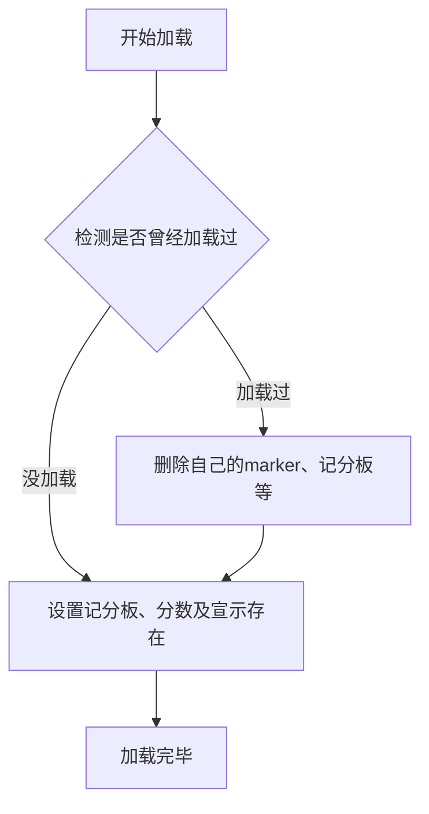
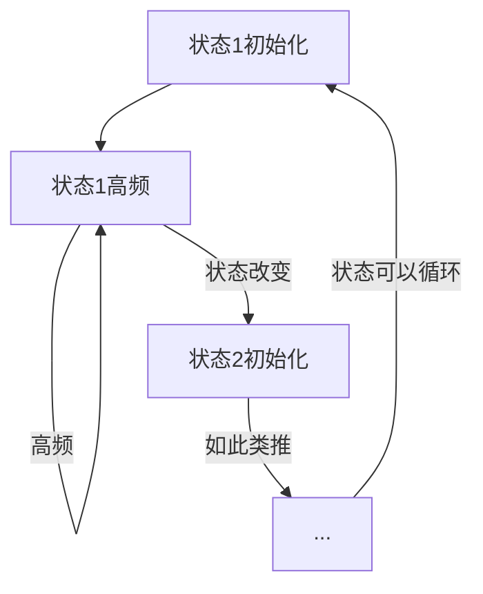
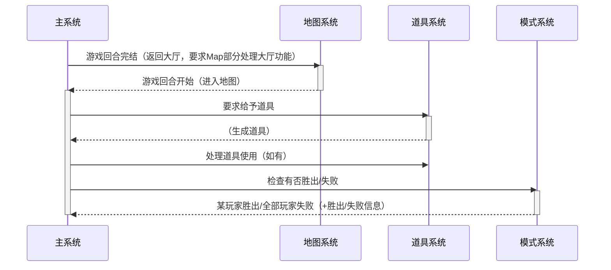

# 系统设计模式
本文件简单、抽象的介绍系统里使用的设计模式，实际接口请参考接口定义。

## 设计理念

*   可读性高
*   松耦合 (Loosely coupled)
*   可扩展 (Extensible)

## 接口模式

系统里大量牵涉到接口的使用，以下将会讲解几个用到的接口模式。

>   注意: 接口实现者必须**遵守约定**，接口才可以正常运作。
>   不同数据包之间的命名空间不应冲突。

### 事件监听 (Event listener)

主系统**提供事件**(tag)供其他**系统监听**(加上tag)，当该事件触发时便会调用那些监听了的命令函数（但**不保证**任何**顺序**，如需确保一定程度的先后顺序，即priority，请使用多个event）。那些事件如果判断为处理完毕，则可以设置特别的假名分数来避免之后的其他命令函数继续执行。

比如道具系统以及胜利、失败检测等也是使用了事件监听模式。

#### 特殊：注册器 (Register)

注册器是一种特殊的事件监听器，只会在**初始化**的时候运行。其运行目的在于**注册信息**到主模块（在本系统的用途则是注册道具、marker以及游戏模式。），并同时设置自己的ID以便之后处理。

### 功能提供者 (Function provider)

主系统里**不定义**某命令函数，由**别的数据包**以类似事件的方式提供，并在**系统加载时检测**执行数（通过`result`）。如果结果并非1（0，即无定义；>1，即发生冲突）则报错。

这是用于把核心模块无法实现的功能（得视乎实际地图的功能）分拆，并确保不会发生冲突的方法。

>   自然，function名称都冲突的话就没撤了...

### 默认实现 (Default implementation)

部分功能我们开放接口，但我们同时会提供默认实现，供用户选择是否覆盖。

这功能会与功能提供者配合，但不会在无定义时报错，而是设置为使用默认实现。

## 设计模式

以下更清楚定义几个名词，方便下文使用：

*   加载 (load): **数据包**加载，包括打开地图时及运行 `reload` 命令时。
*   初始化 (initialize): 在**某阶段开始时**执行。
*   高频 (tick): 在**某阶段不停**执行。

### 加载流程



而检测加载和宣示存在的方式都十分简单。宣示存在就是设置一个特殊假名（其名称不应该和其他系统发生冲突）到指定分数。假如那假名为某个分数，就代表曾经被加载过。

### 初始化及高频



本系统的状态改变如上，使用记分板假名储存状态数据。

### 内部命令函数

使用接口进行设计能简化设计难度，但也会造成多余的调用。我们会使用内部命令函数的方式来避免部分执行。

简单来说，这实际模式就是把命令函数实际内容放在别的函数里，当前函数则改为条件检测（实际上的条件检测未必只是一条命令，以下只是简化版）。

```
# bla:function1
execute if 条件... run function bla:function1_internal
# bla:function1_internal 就是内部命令函数，也就是实际命令。
```

### 暂存 (Caching)

部分检测十分麻烦，如哪个模式才需要检测有没有玩家存在，或默认实现的检测。但是我们可以安全的估计这些**结果**在一段时间内是**不会改变**（前者为游戏的一回合，后者为再次加载前），故此我们可以把这结果暂存到别的分数，简化检测，需要时才重置结果开始检测。

## 主系统构成

系统主要建**基于接口以及约定**。主系统提供了**流程处理**以及**默认机制**，用户可以使用数据包来替换机制、增加功能，从而扩展系统。但是那些数据包必须遵从主系统的约定，否则可能会出现未知错误。



